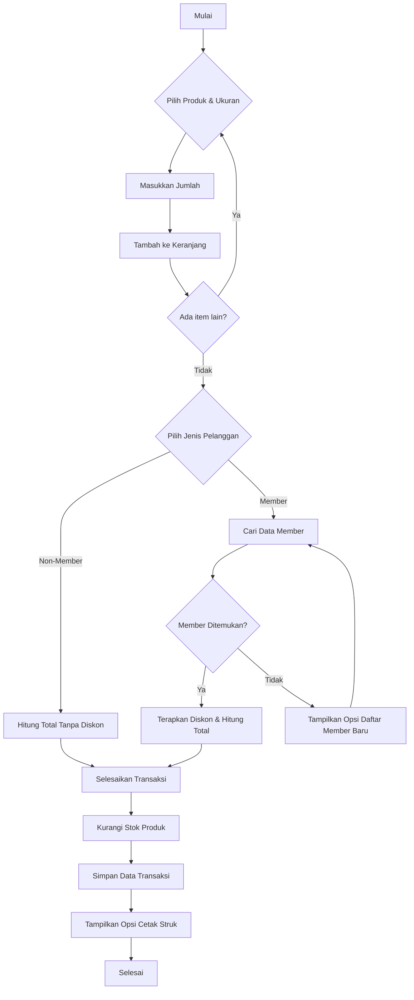

# 🧾 Aplikasi Kasir Toko Baju (Next.js & LocalStorage)

Aplikasi kasir dan katalog penjualan berbasis web yang **modern**, **ringan**, dan **sepenuhnya offline**. Dibangun menggunakan **Next.js** dan **CSS Modules**, dengan **LocalStorage** sebagai satu-satunya media penyimpanan.

> Anda bisa mengganti gambar di bawah ini dengan screenshot aplikasi Anda.
> 
>


---

## 📦 Fitur Utama

- **Manajemen Produk**  
  Tambah, edit, dan hapus produk dengan stok per ukuran (S, M, L, XL, XXL).

- **Transaksi Penjualan**  
  Halaman kasir lengkap dengan keranjang belanja, pencarian member, dan diskon dinamis.

- **Sistem Member**  
  Kelola data member dengan diskon yang bisa diatur manual per anggota dan email pendaftaran di kirim dengan emailjs.

- **Laporan Penjualan**  
  Filter laporan berdasarkan harian, bulanan, atau tahunan, lengkap dengan **chart visual** dan **paginasi**.

- **Cetak Struk**  
  Cetak struk transaksi baru atau cetak ulang struk lama. Dapat disesuaikan untuk printer **thermal 58mm / 80mm**.

- **Manajemen Data**  
  Ekspor laporan ke CSV, backup seluruh data ke file JSON, dan restore dari file JSON.

- **Offline First**  
  Semua data disimpan di **LocalStorage** browser. Tidak butuh koneksi internet untuk menjalankan aplikasi.

- **Autentikasi**  
  Sistem login sederhana dengan akun admin default yang dibuat otomatis saat pertama kali dijalankan.

---

## 🚀 Teknologi yang Digunakan

- **Framework:** Next.js (React)
- **Styling:** CSS Modules (tanpa framework CSS)
- **Penyimpanan:** LocalStorage
- **Charting:** Chart.js via `react-chartjs-2`
- **Fitur Tambahan:**  
  `react-to-print`, `papaparse`, `uuid`, `bcryptjs`

---

## ⚙️ Cara Instalasi dan Menjalankan

### 🧩 Prasyarat

Pastikan Anda sudah menginstal **Node.js versi 18 atau lebih baru**.

### 📥 Clone Repository Ini

```bash
git clone https://github.com/Syzhaa/kasir-baju.git
````


### 📁 Masuk ke Direktori Proyek

```bash
cd kasir-baju
```

### 📦 Install Semua Dependency

```bash
npm install
```
## 📧 Konfigurasi EmailJS

Aplikasi ini menggunakan [EmailJS](https://www.emailjs.com/) untuk mengirim email saat mendaftarkan member.

### Langkah Setup:

1. **Daftar di EmailJS**
   [https://www.emailjs.com](https://www.emailjs.com)

2. **Buat Email Service**

   * Tambah layanan (Gmail, Yahoo, dsb)
   * Simpan **Service ID**

3. **Buat Template**

   * Tambahkan variabel seperti `name`, `email`
     
   * Simpan **Template ID**

4. **Dapatkan Public Key**

   * Bisa ditemukan di halaman API Key

5. **Edit File `components/MemberForm.js`**
   Buka file `components/MemberForm.js`, dan cari bagian kode seperti ini:

   ```js
   const serviceID = 'your_service_id';
   const templateID = 'your_template_id';
   const publicKey = 'your_public_key';
   ```

   Gantilah `your_service_id`, `your_template_id`, dan `your_public_key` dengan nilai dari EmailJS milik Anda.

   **Contoh:**

   ```js
   const serviceID = 'service_xxx123';
   const templateID = 'template_abc456';
   const publicKey = 'xxx_public_key_789';
   ```

---
### ▶️ Jalankan Aplikasi

```bash
npm run dev
```

### 🌐 Buka di Browser

Buka browser Anda dan akses:
[http://localhost:3000](http://localhost:3000)

---

## 🔑 Login Pertama Kali

Saat pertama kali dijalankan, aplikasi akan otomatis membuat akun admin default.

* **Username:** `admin`
* **Password:** `password`

Anda bisa mengubah password di halaman **Edit Profil** setelah login.

---

## ☁️ Deployment

Aplikasi ini sangat mudah di-deploy ke platform seperti **Vercel**:

1. Hubungkan repo GitHub Anda ke Vercel.
2. Deploy otomatis akan dilakukan.
3. Aplikasi siap digunakan online.

---

## 📄 Lisensi

Proyek ini menggunakan lisensi bebas untuk penggunaan pribadi dan edukasi. Silakan sesuaikan jika Anda ingin menggunakan secara komersial.

---

## ❤️ Kontribusi

Pull Request dan masukan sangat diterima! Jangan lupa untuk ⭐ repository ini jika Anda merasa terbantu.

Berikut adalah versi lengkap untuk bagian **Diagram Desain Aplikasi Kasir** dalam format `README.md` GitHub. Semua diagram sudah disusun dengan sintaks dari **Mermaid.js**, yang didukung oleh GitHub untuk pratinjau otomatis. Kamu cukup menempelkan bagian ini ke bawah `README.md` milikmu.

---

## 🧠 Diagram Desain Aplikasi Kasir

Dokumen ini berisi kumpulan diagram desain konseptual yang menggambarkan struktur data, arsitektur perangkat lunak, dan alur kerja utama dari aplikasi kasir.

---

### 1. 🗃️ Entity-Relationship Diagram (ERD)

ERD ini memvisualisasikan entitas data utama dan hubungan antar entitas tersebut:

```mermaid
erDiagram
    PRODUK {
        string id PK
        string nama
        string deskripsi
        int harga
        json stok "Contoh: {S:10, M:15}"
    }
    MEMBER {
        string id PK
        string nama
        string no_hp
        string email
        int diskon_persen
    }
    TRANSAKSI {
        string id PK
        datetime tanggal
        int total_harga
        int total_diskon
        string member_id FK
    }
    DETAIL_TRANSAKSI {
        string produk_id FK
        string transaksi_id FK
        string ukuran
        int jumlah
        int harga_satuan
    }
    PRODUK ||--o{ DETAIL_TRANSAKSI : "memiliki"
    TRANSAKSI ||--|{ DETAIL_TRANSAKSI : "terdiri dari"
    MEMBER }o--|| TRANSAKSI : "melakukan"
````

---

### 2. 🧩 Class Diagram

Class Diagram ini memodelkan struktur kode aplikasi, menunjukkan kelas-kelas utama, atributnya, serta metode (fungsi) yang dimilikinya:

```mermaid
classDiagram
    class AppContext {
        +List~Produk~ products
        +List~Member~ members
        +List~Transaksi~ transactions
        +User currentUser
        +addProduct(data)
        +addMember(data)
        +addTransaction(data)
        +login(user, pass)
        +logout()
    }

    class Produk {
        -string id
        -string nama
        -int harga
        -object stok
    }

    class Member {
        -string id
        -string nama
        -int diskon
    }

    class Transaksi {
        -string id
        -datetime tanggal
        -List~object~ items
    }

    class User {
        -string id
        -string username
        -string hashedPassword
    }

    AppContext "1" -- "0..*" Produk : Mengelola
    AppContext "1" -- "0..*" Member : Mengelola
    AppContext "1" -- "0..*" Transaksi : Mengelola
    AppContext "1" -- "0..*" User : Mengelola
```

---

### 3. 🔄 Activity Diagram — Proses Transaksi Penjualan

Activity Diagram ini menggambarkan alur kerja dari proses transaksi dari awal hingga selesai:



---

💡 **Catatan**: GitHub mendukung sintaks Mermaid secara otomatis dalam file Markdown, jadi Anda dapat melihat visualisasinya langsung saat membuka repositori di GitHub.

---

Butuh juga diagram **State Diagram** atau **Sequence Diagram** tambahan untuk bagian login atau cetak struk? Saya bisa bantu buatkan. Mau lanjut? 😊

```

---

Jika kamu ingin, saya juga bisa:

- Memecah diagram jadi file `.md` tersendiri
- Membuat visual statis (gambar PNG/SVG)
- Menambahkan link langsung ke kode (`AppContext`, `Transaksi`, dll)

Mau lanjut ke bagian itu?
```


